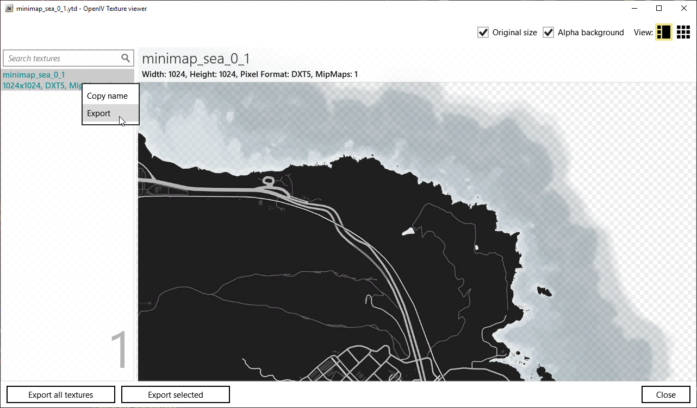
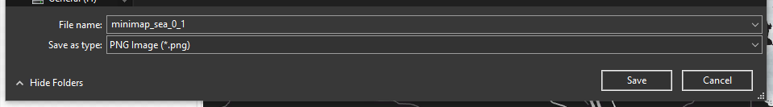

# fivem-webinterface

This is the Web Interface for the FiveM addon [live_map](https://github.com/TGRHavoc/live_map).

- [fivem-webinterface](#fivem-webinterface)
  - [Prerequisites](#prerequisites)
  - [How to install](#how-to-install)
  - [Configuration](#configuration)
    - [config.json](#configjson)
      - [defaults object](#defaults-object)
      - [reverse proxy object](#reverse-proxy-object)
      - [server object](#server-object)
      - [map object](#map-object)
    - [config.html](#confightml)
    - [Custom images](#custom-images)
  - [Thanks](#thanks)

## Prerequisites

In order to have this working, it is advised that you already have a webserver running and correctly configured.
You will also need to install [live_map](https://github.com/TGRHavoc/live_map) on your FiveM server and have it configured.

## How to install

Download the [latest version](https://github.com/TGRHavoc/live_map-interface/archive/master.zip).

This should be enough to get the interface up and running on your website. If you want to change stuff like the images, look in the [configuration](#configuration) section


## Configuration

### config.json
The only file you will need to change to configure the map is the `config.json` file.
This file can have comments in it without breaking the interface.
Below is a table with the different things you can put into your `config.json` file.

| Name            | Type                               | Example                                                                                                      |                                                         What it does                                                          |
| :-------------- | ---------------------------------- | ------------------------------------------------------------------------------------------------------------ | :---------------------------------------------------------------------------------------------------------------------------: |
| debug           | boolean                            | false                                                                                                        |                                            This just enables/disables debug mode.                                             |
| tileDirectory   | string                             | "images/tiles"                                                                                               |   This is the directory that the interface should look in to find the tiled images. Note: This is used in the `maps` array    |
| iconDirectory   | string                             | "images/icons"                                                                                               |                                     This is where the interface can find the icon images                                      |
| showIdentifiers | boolean                            | false                                                                                                        | This determines whether the interface shows a player's identifier or not. Note: This may be an IP (if server has it enabled). |
| defaults        | [default object](defaults-object)  | `"defaults": { "ip": "tgrhavoc.me", "fivemPort": "30120", "socketPort": "30121", "liveMapName": "live_map"}` |               This is the default the interface should fall back to use if a server doesn't have the value set.               |
| servers         | [server object](server-object)     | `"A server": {"ip": "example.com"}`                                                                          |                              This is the object that contains the server data for the interface.                              |
| maps            | array of [map objects](map-object) | `"maps": [{"name": "Normal", "url": "{tileDirectory}/normal/minimap_sea_{y}_{x}.png"}]`                      |                        An array containing the different map tiles available to use on the interface.                         |

#### defaults object
| Name         | Type                                         | Example                                       |                                      What it does                                      |
| :----------- | -------------------------------------------- | --------------------------------------------- | :------------------------------------------------------------------------------------: |
| ip           | string                                       | "example.com"                                 |                        The **public** IP for your FiveM server.                        |
| socketPort   | number                                       | 30121                                         |                    The port your LiveMap resource is listening on.                     |
| reverseProxy | [reserse proxy object](reverse-proxy-object) | `{"blips": "https://example.com/blips.json"}` | If you have a reverse proxy set up for the blips and socket connection, then use this. |


#### reverse proxy object

| Name   | Type   | Example                                  |                                                                           What it does                                                                           |
| :----- | ------ | ---------------------------------------- | :--------------------------------------------------------------------------------------------------------------------------------------------------------------: |
| socket | string | "wss://echo.example.com"                 | The URL to the reverse proxy for the websocket connection. If you're using NGINX, the [following should be useful](https://www.nginx.com/blog/websocket-nginx/). |
| blips  | string | "https://example.com/server1/blips.json" |                              The URL to the reverse proxy for the blips file (can even just be a static JSON file on a webserver).                               |

#### server object
The server objects must have a key whoes value is the server's name. 
For example, if you have a server called `This is my cool server` then, the server entry would look like. 
```json
"servers" : {
    "This is my cool server" : {
        "ip": "example.com"
    }
}
```

**If you don't set something in this object, the interface will look at the "defaults" object and use it's values instead.**
It's therefore best practice to only use the `revserProxy` property in the server's object itself.

| Name         | Type                                         | Example                                       |                                      What it does                                      |
| :----------- | -------------------------------------------- | --------------------------------------------- | :------------------------------------------------------------------------------------: |
| ip           | string                                       | "example.com"                                 |                        The **public** IP for your FiveM server.                        |
| socketPort   | number                                       | 30121                                         |                    The port your LiveMap resource is listening on.                     |
| reverseProxy | [reserse proxy object](reverse-proxy-object) | `{"blips": "https://example.com/blips.json"}` | If you have a reverse proxy set up for the blips and socket connection, then use this. |


#### map object

| Name    | Type   | Example                                          |                                                                  What it does                                                                   |
| :------ | ------ | ------------------------------------------------ | :---------------------------------------------------------------------------------------------------------------------------------------------: |
| name    | string | "Postal"                                         |                                  The name of this tileset. This is used when the user wants to change the map                                   |
| url     | string | "{tileDirectory}/postal/minimap_sea_{y}_{x}.png" | Where the images are located for this map. GTA's minimap files have the Y coordinate before the X coordinate hence the `{y}_{x}` in the string. |
| minZoom | number | -3                                               |                    How many times can the user zoom out for this tile set. The lower the number, the more they can zoom out.                    |

### config.html

If you're more of a visual person and, don't want to write a bunch of JSON to set up your server, you can use the utility page `config.html`.
To get to this, just navigate to `utils/config.html` in your browser.
This will give you a basic interface which, you can use to quickly configure the interface.

<small>**Please note: You cannot add maps via this page. You will need to do this manually.**</small>


### Custom images

It's now fairly easy to use your own, custom images in the interface.

- Make a new folder in your `tileDirectory` directory (optional but, recommended)
- Put images into folder
- Add an entry to the `maps` array in the config.

Those are the only three steps you need!
Now, getting the images is a different matter.
If you have a custom "minimap" you use in game, you can probably use it with the interface as well. 
All you need to do is extract the images from the YTD files with a program like OpenIV.
If doing this, using the `minimap_sea` images will result in a much higher quality.





## Thanks

Special thanks to the people who helped me test this, flushing out any bugs that managed to sneak in.

- [AciD](https://github.com/xlxAciDxlx)
- [KjayCopper](https://github.com/KjayCopper)
- [IllusiveTea](https://github.com/IllusiveTea)
- [Tom Grobbe](https://github.com/TomGrobbe)
