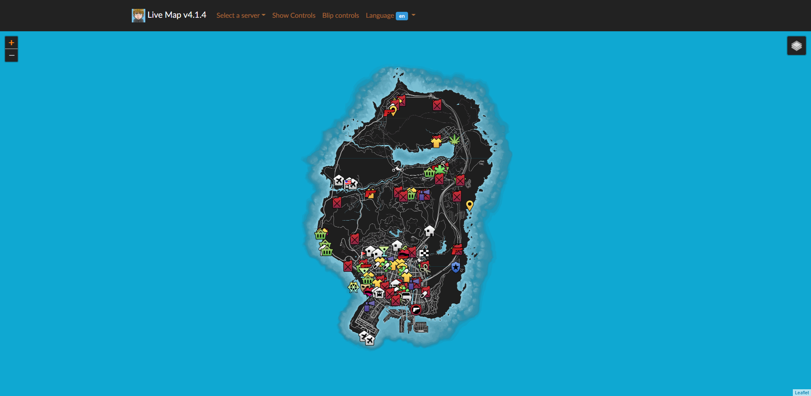
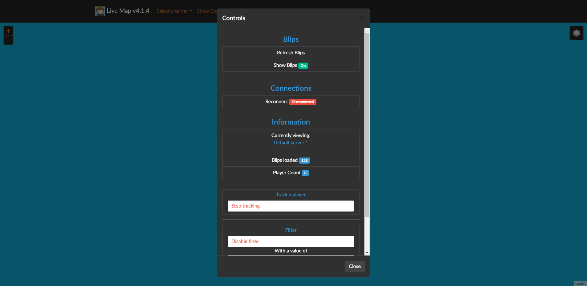
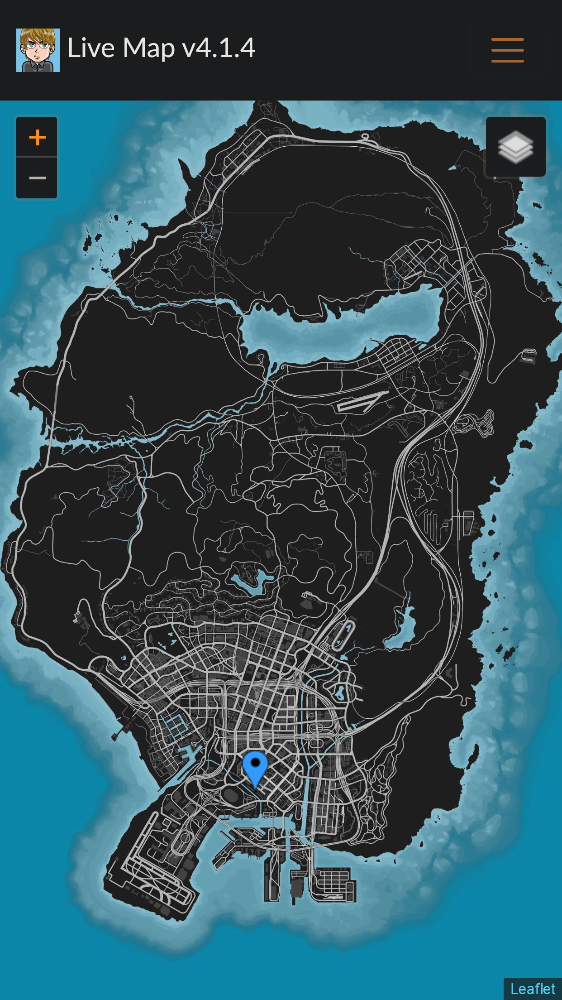
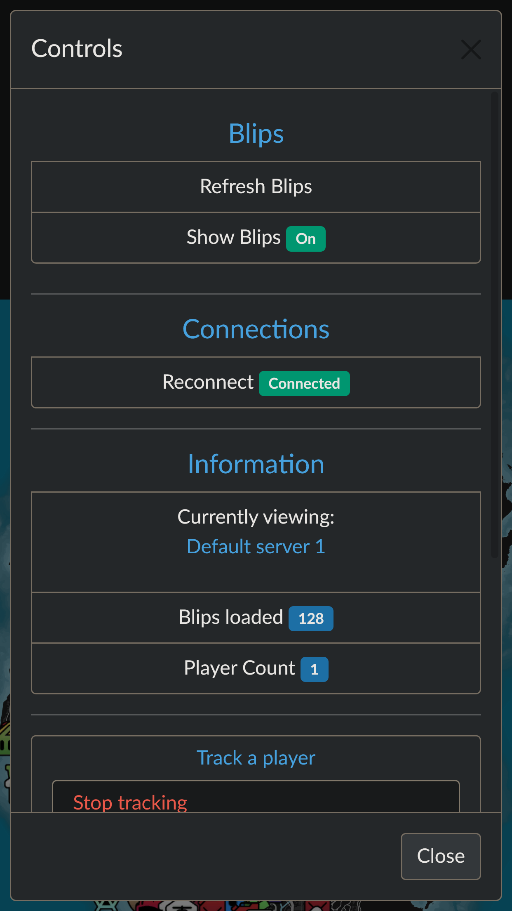
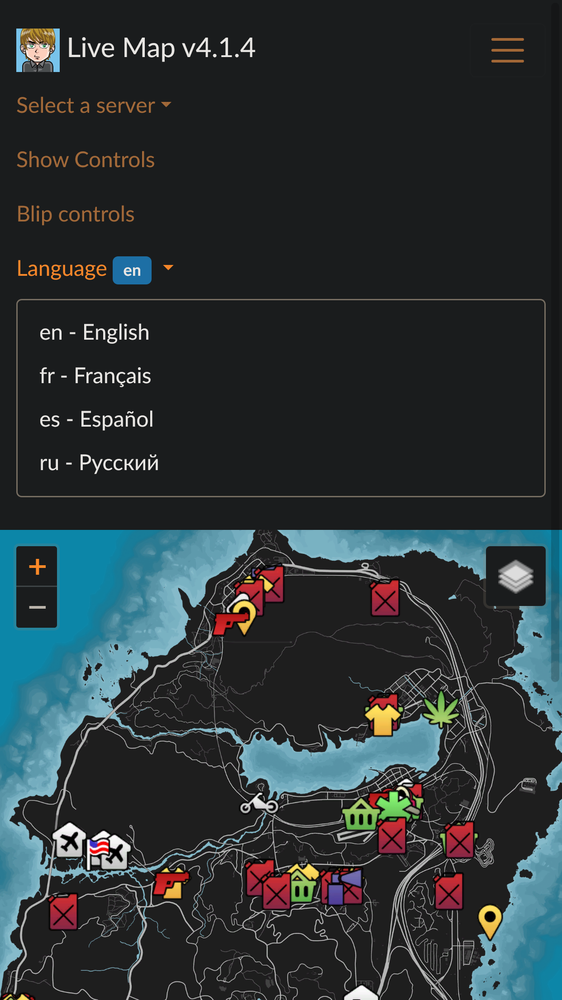
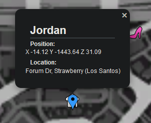

# LiveMap interface <!-- omit in toc -->
<!-- ALL-CONTRIBUTORS-BADGE:START - Do not remove or modify this section -->

<!-- ALL-CONTRIBUTORS-BADGE:END -->

    

This is the Web Interface for the FiveM addon [live_map](https://github.com/TGRHavoc/live_map).

- [Prerequisites](#prerequisites)
- [How to install](#how-to-install)
- [Screenshots 🖼️](#screenshots-️)
- [Frequently Asked Questions ❓](#frequently-asked-questions-)
- [Adding custom maps 🗺️](#adding-custom-maps-️)
- [Developers Information 🧑‍💻](#developers-information-)
- [Contributors ✨](#contributors-)

## Prerequisites

In order to have this working, it is advised that you already have a webserver running and correctly configured.
You will also need to install [live_map](https://github.com/TGRHavoc/live_map) on your FiveM server and have it configured.

## How to install 

Download the [latest version](https://github.com/TGRHavoc/live_map-interface/archive/master.zip).

This should be enough to get the interface up and running on your website. If you want to change stuff like the images, look in the [configuration](config.md) section.

## Screenshots 🖼️

|  |  |
| :----------------------------------------------------------------------------------------------: | :---------------------------------------------------------------------------------------------: |
|                                     Main Interface (Desktop)                                     |                                     Control Modal (Desktop)                                     |

|  |  |
| :--------------------------------------------------------------------------------------------------: | :-----------------------------------------------------------------------------------------------: |
|                                     Blip control modal (Desktop)                                     |                                     Language Select (Desktop)                                     |

|  |  |
| :-------------------------------------------------------------------------------------------------------: | :------------------------------------------------------------------------------------------------------: |
|                                          Main Interface (Mobile)                                          |                                          Control Modal (Mobile)                                          |

|  |  |
| :-----------------------------------------------------------------------------------------------------------: | :--------------------------------------------------------------------------------------------------------: |
|                                          Blip control modal (Mobile)                                          |                                          Language Select (Mobile)                                          |

|  |
| :--------------------------------------------------------------------------------------------------: |
|                                     Player information (example)                                     |

|  |
| :------------------------------------------------------------------------------------------------: |
|                                        GIF of the interface                                        |

## Frequently Asked Questions ❓ 

If you run into any issues, consult the [F.A.Q.](FAQ.md) first. Amongst other things, this document contains information about common issues involving:
- server not connecting/showing up
- unable to communicate with FiveM server
- errors getting blips
- issues with localhost

## Adding custom maps 🗺️
Information on how to add custom maps from GTA or alternative into livemap. See [Custom Maps](custom_maps.md).

## Developers Information 🧑‍💻 

Useful information for developers on dependencies and files locations for development. See [Developers Information](developers.md).

## Contributors ✨

Thanks goes to these wonderful people ([emoji key](https://allcontributors.org/docs/en/emoji-key)):

<!-- ALL-CONTRIBUTORS-LIST:START - Do not remove or modify this section -->
<!-- prettier-ignore-start -->
<!-- markdownlint-disable -->
<table>
  <tr>
    <td align="center"><a href="https://tgrhavoc.co.uk/"> <b>Jordan Dalton</b></a> <a href="https://github.com/TGRHavoc/live_map-interface/commits?author=TGRHavoc" title="Code">💻</a> <a href="https://github.com/TGRHavoc/live_map-interface/commits?author=TGRHavoc" title="Documentation">📖</a> <a href="#design-TGRHavoc" title="Design">🎨</a> <a href="#ideas-TGRHavoc" title="Ideas, Planning, & Feedback">🤔</a></td>
    <td align="center"><a href="https://tomgrobbe.nl/"> <b>Tom</b></a> <a href="https://github.com/TGRHavoc/live_map-interface/issues?q=author%3ATomGrobbe" title="Bug reports">🐛</a> <a href="https://github.com/TGRHavoc/live_map-interface/commits?author=TomGrobbe" title="Code">💻</a></td>
    <td align="center"><a href="https://xlxacidxlx.com/"> <b>AciD</b></a> <a href="https://github.com/TGRHavoc/live_map-interface/issues?q=author%3AxlxAciDxlx" title="Bug reports">🐛</a> <a href="https://github.com/TGRHavoc/live_map-interface/commits?author=xlxAciDxlx" title="Code">💻</a></td>
    <td align="center"><a href="https://github.com/jiynn"> <b>jiynn</b></a> <a href="https://github.com/TGRHavoc/live_map-interface/issues?q=author%3Ajiynn" title="Bug reports">🐛</a></td>
    <td align="center"><a href="https://github.com/Local9"> <b>127.0.0.1</b></a> <a href="https://github.com/TGRHavoc/live_map-interface/issues?q=author%3ALocal9" title="Bug reports">🐛</a> <a href="https://github.com/TGRHavoc/live_map-interface/commits?author=Local9" title="Code">💻</a></td>
  </tr>
  <tr>
    <td align="center"><a href="https://github.com/davwheat"> <b>David Wheatley</b></a> <a href="https://github.com/TGRHavoc/live_map-interface/commits?author=davwheat" title="Code">💻</a> <a href="https://github.com/TGRHavoc/live_map-interface/issues?q=author%3Adavwheat" title="Bug reports">🐛</a></td>
    <td align="center"><a href="https://github.com/DaveOkpare"> <b>David Okpare</b></a> <a href="https://github.com/TGRHavoc/live_map-interface/commits?author=DaveOkpare" title="Documentation">📖</a></td>
    <td align="center"><a href="https://github.com/matsn0w"> <b>matsn0w</b></a> <a href="https://github.com/TGRHavoc/live_map-interface/commits?author=matsn0w" title="Code">💻</a> <a href="https://github.com/TGRHavoc/live_map-interface/issues?q=author%3Amatsn0w" title="Bug reports">🐛</a></td>
    <td align="center"><a href="https://github.com/JasonO99"> <b>Jason Olsen</b></a> <a href="https://github.com/TGRHavoc/live_map-interface/issues?q=author%3AJasonO99" title="Bug reports">🐛</a></td>
    <td align="center"><a href="https://github.com/Aaron-Downham"> <b>Aaron-Downham</b></a> <a href="https://github.com/TGRHavoc/live_map-interface/issues?q=author%3AAaron-Downham" title="Bug reports">🐛</a></td>
  </tr>
  <tr>
    <td align="center"><a href="https://github.com/Annihilator4423"> <b>Annihilator4423</b></a> <a href="https://github.com/TGRHavoc/live_map-interface/commits?author=Annihilator4423" title="Documentation">📖</a></td>
    <td align="center"><a href="https://github.com/Cu-chi"> <b>Cuchi'</b></a> <a href="#translation-Cu-chi" title="Translation">🌍</a></td>
  </tr>
</table>

<!-- markdownlint-restore -->
<!-- prettier-ignore-end -->

<!-- ALL-CONTRIBUTORS-LIST:END -->

This project follows the [all-contributors](https://github.com/all-contributors/all-contributors) specification. 
Contributions of any kind welcome!

If you would like to contribute, then check out the [contributing guide](contributing.md).
