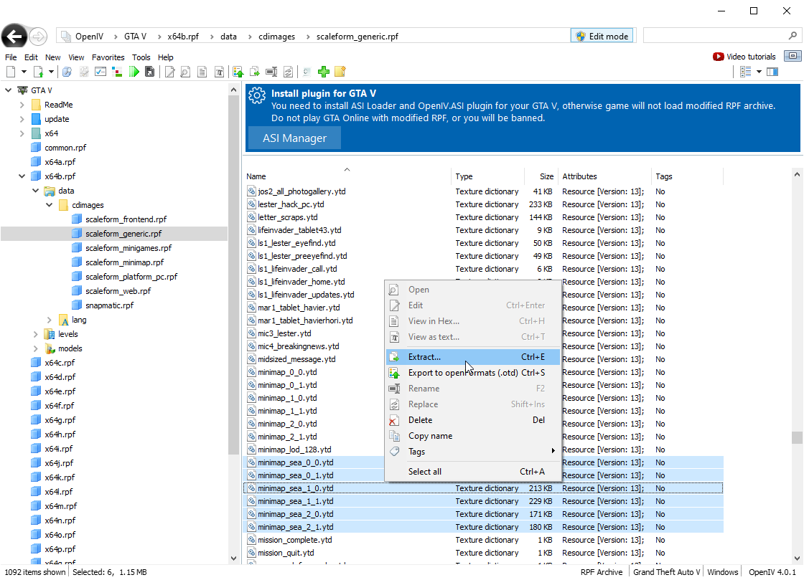
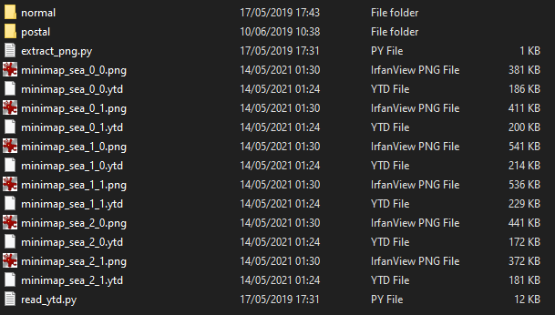

# Custom Images <!-- omit in toc -->

It's possible to have custom map images in LiveMap.
You can do this if you want LiveMap to show the same map that you have in game, cool right?

It's a bit of an involved process but, if you're willing to put in the time, the result is worth it.

Note: You must have [Python 3](https://www.python.org/downloads/) installed.

- [Step 1: Extract YTD](#step-1-extract-ytd)
- [Step 2: Installing Pillow](#step-2-installing-pillow)
- [Step 3: Getting the Images](#step-3-getting-the-images)
- [Step 4: Configure the map](#step-4-configure-the-map)

## Step 1: Extract YTD
If you have a custom map in FiveM then, you should already have the YTD files.

If not, then you can extract them from GTA using [OpenIV](https://openiv.com/).
The default path for the minimap files is `GTA V\x64b.rpf\data\cdimages\scaleform_generic.rpf\`.
I recommend that you extract the `minimap_sea` files if they are available as they're generally higher quality.



I recommend you extract the files into the [images/tiles](https://github.com/TGRHavoc/live_map-interface/tree/master/images/tiles) directory.
If not, make sure to copy the Python scripts to the same directory as your YTD files.

## Step 2: Installing Pillow

Time to install [Pillow](https://pypi.org/project/Pillow/).

```shell
❯ python -m pip install Pillow
```

## Step 3: Getting the Images

This set is as easy as `python extract_png.py`.

This should output something like the following:
```shell
 live_map-interface\images\tiles  @4.0.1   develop ± 
❯ python extract_png.py
minimap_sea_0_0.ytd
Magic: b'RSC7', 0x37435352
Version in header: 13
System flag = 131072, Graphics flag = 3489660947
Calculated version '13'. Valid RSC7 header
Shift (system) : 0
Shift (gfx) : 3
Size calculated: 1056784, Size of system: 8192, Size of gfx: 1048576. SIZE: 190009
--- SNIP ---
Read name: minimap_sea_2_1
Reading from GFX
Done
```

This should give you some PNG files!



Put these into their own folder.

For example: `new-map`
```shell
new-map/
--- minimap_sea_0_0.png
--- minimap_sea_0_1.png
--- minimap_sea_1_0.png
--- minimap_sea_1_1.png
--- minimap_sea_2_0.png
--- minimap_sea_2_1.png
```

## Step 4: Configure the map

Make sure you add the new map images to `config.json`.
Using the example above, you would add the following to the [maps section of the config](config.md#config.json).

```json
{
    "name": "New Map",
    "url": "{tileDirectory}/new-map/minimap_sea_{y}_{x}.png",
    "minZoom": -2 // Set lower to zoom out more
}
```

So, it would look like
```json
"maps" : [
    {
        "name": "Normal",
        "url": "{tileDirectory}/normal/minimap_sea_{y}_{x}.png",
        "minZoom": -2 // Set lower to zoom out more
    },
    {
        "name": "New Map",
        "url": "{tileDirectory}/new-map/minimap_sea_{y}_{x}.png",
        "minZoom": -2 // Set lower to zoom out more
    },
    {
        "name": "Postal",
        "url": "{tileDirectory}/postal/minimap_sea_{y}_{x}.png",
        "minZoom": -3 // Since this is 3 times bigger, just remove 3 from the default minZoom
    }
]
```

If you _just_ wanted the new map, that would be the only entry:
```json
"maps" : [
    {
        "name": "New Map",
        "url": "{tileDirectory}/new-map/minimap_sea_{y}_{x}.png",
        "minZoom": -2 // Set lower to zoom out more
    }
]
```
